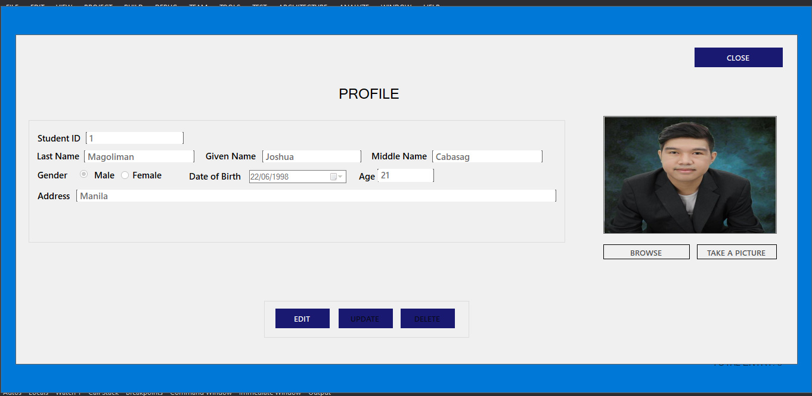

# MY SIMPLE CRUD IN VB.NET AND MS ACCESS

* Purpose: My Project
* Programming Language: Visual Basic.Net
* Target Framework: .Net Framework
* IDE: MS Visual Studio 
* Backend Database: MS Access
* Type of Application: Desktop Application (Windows Forms)
  
<h2> User Interface Screenshots </h2> 
  
  
  
  
  
  
  
  
  
	
  
	  
  
				  
  
  
  
  

  
